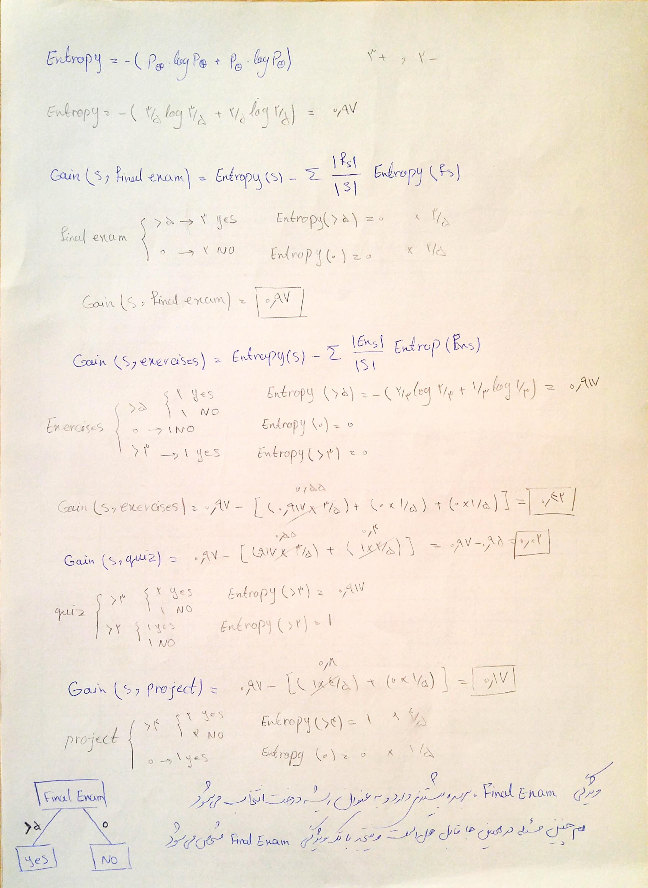

روش ID3 یک روش برای ساخت درخت تصمیم می باشد که بر اساس Gain(بهره) هر ویژگی درخت را می سازد. در واقع این الگوریتم به درخت تصمیم اضافه می شود و با مراحلی که دارد درخت را کامل می کند و به دنبال بهبود درخت تصمیم می باشد.
  
روش ID3 یک الگوریتم Supervised Learning است.

در این روش همانند درخت تصمیم، به دنبال درختی با عمق کم هستیم.

ملاک تشخیص بهترین گره در درخت تصمیم غیر باینری Information Gain(بهره اطلاعاتی) می باشد. به این صورت که برای همه ویژگی ها بهره اطلاعاتی را به دست می آوریم و گرهی که بالاترین Gain را دارد بهترین است.

در ابتدا با به دست آوردن میزان Entropy(بی نظمی) کلی داده ها و سپس آنتروپی هر حالت ویژگی ها، Information Gain داده نسبت به هر ویژگی را به دست آورده و در انتها آن ویژگی که بیشترین مقدار بهره اطلاعاتی را دارد در ریشه درخت تصمیم قرار می گیرد.

این روند را برای هر ویژگی ادامه می دهیم تا درخت تصمیم ساخته شود.

Entropy = -(p+.log p+ + p-.log p-)
 
  p+ : احتمال وقوع پیشامد مثبت
 
  p- : احتمال وقوع پیشامد منفی
  
احتمال همواره مقداری بین 0 و 1 دارد و مجموع احتمال مثبت و منفی 1 می شود.
  
هر چه آنتروپی یک سیستم بیشتر باشد یعنی سیستم تصادفی تر و غیر قابل پیش بینی تر است. اگر آنتروپی 0 باشد، یعنی بی نظمی سیستم 0 و قطعی است و اگر سیستم دارای بیشترین آنتروپی یعنی 1 باشد، سیستم کاملا تصادفی و غیر قابل پیش بینی است.
  
 
  
Gain(S,A) = Entropy(S) - ∑ (|Sv |)/(|S|).Entropy(Sv)
   
S :  داده
 
A : ویژگی خاص
 
Sv : هر حالت ویژگی
 
|S| : تعداد داده ها
 
  
  
| student | final exam | excercises | quiz | project | pass |
|---------|------------|------------|------|---------|------|
| 1       | >5         | >5   	    | >3   | >4      | yes  | 
| 2       | 0          | 0    	    | >2   | >4      | no   |
| 3       | >5         | >5   	    | >3   | 0       | yes  |
| 4       | 0          | >5    	    | >3   | >4      | no   |
| 5       | >5         | >3         | >2   | >4      | yes  |

  
 
 
  
حساسیت این روش به دلیل این که با احتمال سر و کار دارد و آماری تر است نسبت به Noise کمتر است و به نسبت روش ساخت درخت تصمیم با یافتن میزان خطا تاثیر اشتباه را کمتر می کند.

