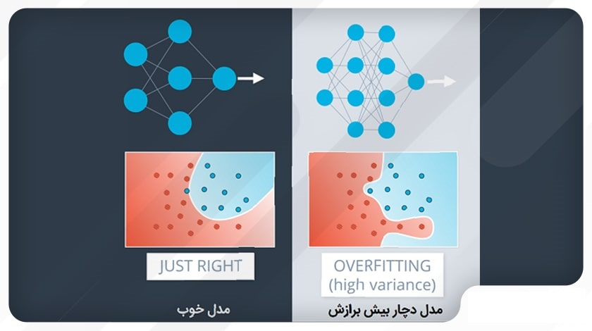

#### Ovefitting:

وقتی فرضیه ای را پیدا میکنیم که روی مثال های آموزشی خوب عمل میکند و خطای آن 0 است اما در مثال های آزمایشی(داده های واقعی) دقت آن کم میشود میگوییم Overfit شده است
Overfit شدن مانند این است که زیادی به مثال های آموزشی بها دهیم(بیش از حد)
این خطا هنگامی اتفاق می‌افتد که مدل ویژگی‌های داده‌های آموزشی را به‌جای یادگیری، حفظ کرده باشد، یعنی بیش‌ازحد روی آن آموزش دیده باشد؛ درنتیجه، این مدل فقط در مجموعه‌ی داده‌های آموزشی مفید خواهد بود و نه در مجموعه‌ی داده‌های دیگر که هنوز آن‌ها را ندیده است.
دلایل ایجاد بیش‌برازش (Overfitting)

بیش‌برازش (Overfitting) می‌تواند به یکی از این دلایل اتفاق بیفتد:
مدل بیش‌ازحد پیچیده است و ویژگی‌های هم‌خط (Collinear) را دربرمی‌گیرد که واریانس داده‌های ما را افزایش می‌دهد؛
تعداد ویژگی‌های داده‌های ما بیشتر یا برابر با تعداد داده است؛
حجم داده بسیار کم است.
داده پیش‌پردازش نشده تمیز نیست و نویز (Noise)‌ دارد.

 

#### Local minimum:
مینیمم محلی نقطه ای است که مینیمم کلی نیست اما در ناحیه ای که قرار دارد نقطه مینیمم آن قسمت می باشد در (در بین همسایگان نقطه مینیمم است و نه در حالت کلی).
در مسائل هوش مصنوعی دوست داریم درگیر مینیمم محلی نشویم و جواب بهینه را پیدا کنیم و اگر در مینیمم بیفتیم سعی میکنیم از آن خارج شویم بلکه در یک مینیمم بهتر قرار گیریم

 

#### Gradient descent:
«گرادیان کاهشی» (Gradient Descent) یک الگوریتم بهینه‌سازی برای پیدا کردن کمینه یک تابع است. در این الگوریتم کار با یک نقطه تصادفی روی تابع آغاز می‌شود و روی جهت منفی از گرادیان تابع حرکت می‌کند تا به کمینه محلی/سراسری برسد.
گرادیان نزولی الگوریتمی برای یافتن نقطه مینیمم یک تابع است.
گرادیان کاهشی رایج ترین الگوریتم بهینه سازی در یادگیری ماشین و یادگیری عمیق به حساب می آید. این یک الگوریتم بهینه سازی مرتبه اول (first-order) است. این بدان معنی است که هنگام به روزرسانی های پارامترها فقط مشتق اول را در نظر می گیرد. در هر تکرار پارامترها را در جهت عکس گرادیان تابع هدفJ(w)  به روزرسانی می کنیم آن هم با در نظر گرفتن پارامترهایی که گرادیان با تند ترین شیب به بالا سوق می دهد. اندازه گامی که در هر تکرار برای رسیدن به کمینه محلی (local minimum) برمی داریم با توجه به نرخ یادگیری α تعیین می شود. بنابراین مسیر سراشیبی را دنبال می کنیم تا به کمینه محلی (local minimum) برسیم.

 

#### Eager and lazy learning:
روش های یادگیری به 2 دسته تقسیم میشوند: Eager(مشتاق) و Lazy(تنبل)
روش های Eager روش هایی هستند که وقتی مثالی به آن ها داده میشود سعی میکنند سریعاً از روی مثال ها فرضیه بدست آورند و زمانی که نمونه جدید وارد میشود بر اساس فرضیه بدست آمده نتیجه آن را مشخص میکنند.
درخت تصمیم یک روش Eager است.

روش های lazy روش هایی هستند که تا زمانی که از آن ها سوالی پرسیده نشود کاری انجام نمیدهند یعنی با مثال ها تقریبا کاری ندارند و اقدامی انجام نمیدهند و فقط  زمانیکه سوال پرسیده می شود وارد محاسبات شده و سعی میکنند از روی مثال ها جواب را پیدا کنند و از قبل فرضیه ای برای این کار ندارند که بر اساس آن پیش روند
knn یک روش lazy می باشد.

در فاز آموزش روش های Lazy (چون با توجه به تعریف اصلا فاز آموزشی ندارند) و در فاز آزمایش روش های Eager سریعتر هستند
از آنجایی که سرعت در فاز آزمایش(test) مهم تر است در کل روش های Eager روش های بهتری هستند.
