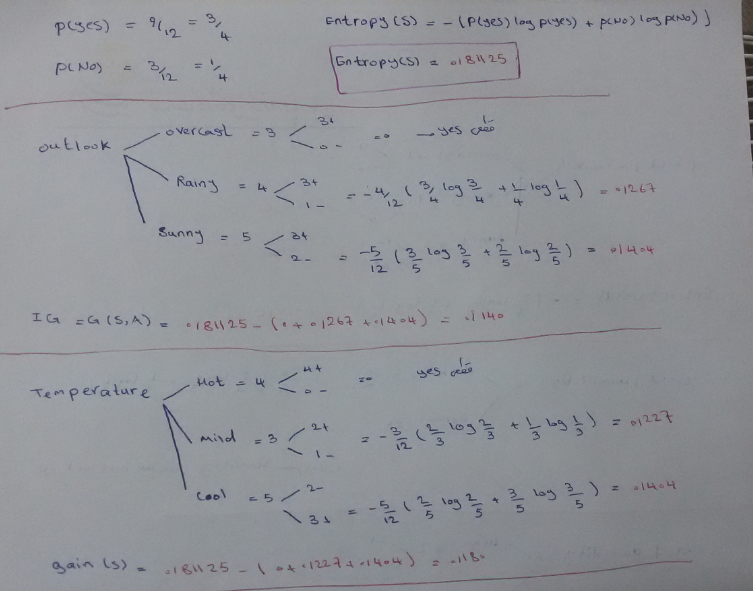
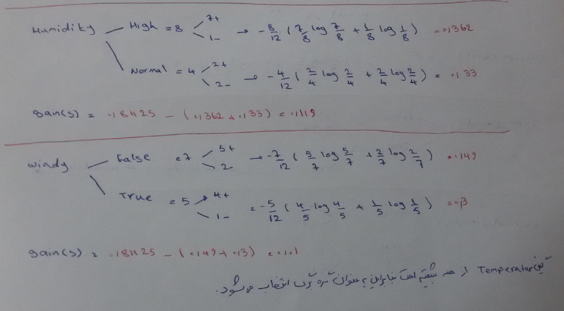
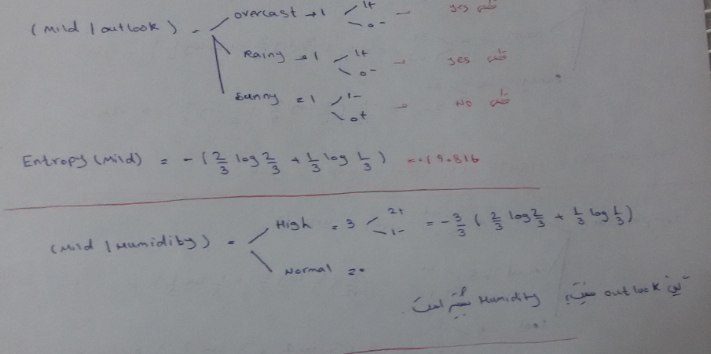
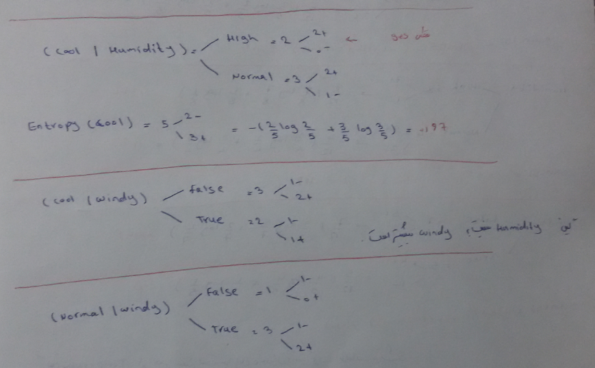

# با روش id3 درخت تصمیم را رسم کنید.

الگوریتم ID3 یکی از الگوریتم های پایه برای ساختِ درخت های تصمیم است. در یک درخت تصمیم، مهم است که کدام یک از ویژگی ها (یا همان ابعاد) را در سطوح بالاتری از درخت انتخاب کنیم تا به طبقه بندی کمک کند.
 
 در روش id3 نیاز به محاسبه انتروپی و information gain داریم:

برای محاسبه انتروپی از فرمول زیر استفاده میکنیم :

 Entropy(S)= -((p+ logp+) + (p-logp-))
 
 برای محاسبه information gain از رابطه زیر استفاده میکنیم:
 
 IG(S, A) = Entropy(S) - ∑((|Sᵥ| / |S|) * Entropy(Sᵥ))
 
 S تعداد داده ها 
 
 A ویژگی خاص
 
 |S| تعداد کل مثال ها
 
 |Sv| مقادیر خاص ویژگی
 
 برای جدول زیر میخواهیم درخت تصمیم را رسم کنیم با استفاده از روش id3:
 
 
| day | outlook  | temperature | humidity | windy | play |
|-----|----------|-------------|----------|-------|------|
| 1   | overcast | hot         | high     | false | yes  |
| 2   | rainy    | mild        | high     | false | yes  |
| 3   | rainy    | cool        | normal   | false | no   |
| 4   | sunny    | mild        | high     | false | no   |
| 5   | overcast | mild        | high     | false | yes  |
| 6   | sunny    | cool        | normal   | true  | no   |
| 7   | sunny    | hot         | normal   | true  | yes  |
| 8   | rainy    | cool        | high     | false | yes  |
| 9   | sunny    | cool        | high     | false | yes  |
| 10  | overcast | cool        | normal   | true  | yes  |
| 11  | sunny    | hot         | high     | true  | yes  |
| 12  | rainy    | hot         | high     | true  | yes  |

در مرحله اول انتروپی را برای داده های مثبت و منفی محاسبه میکنیم سپس IG ا برای هرویژگی بدست می اوریم. ویژگی که بالاترین IG را داشته باشد به عنوان گره اصلی انتخاب میشود.

گین humidity نسبت به windy بیشتر است بنابراین humidity به عنوان گره انتخاب میشود. دو نمونه دارد که نمونه high جواب قطعی yes میدهدولی برای normal جواب قطعی نداریم و باید دوباره محاسبه کنیم. چون یک yes و یک no داریم با بررسی outlook در حالتی که temperature ، cool و humidity ، normal باشدنیازی به محاسبات نداریم و درخت تکمیل میشود.

