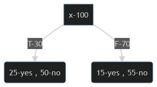

### مفهوم درخت تصمیم یا decision tree را با ذکر ویژگی های کلی آن نام ببرید.
درخت تصمیم همانند تمام درخت ها شامل تعدادی گره و شاخه میباشد و کمک میکند تا بهترین فرضیه را از میان فرضیه های موجود انتخاب نماییم 
در نتیجه از میان فرضیه ها ،فرضیه ای که کمترین خطا را دارد به عنوان ریشه در درخت قرار میگیرد .  
در درخت تصمیم گره های میانی سوال ها یا ویژگی های ماهستند و برگ ها هم نتیجه نهایی ما هستند (به عنوان مثال نتیجه ی مثبت یا منفی به سمی بودن یک قارچ که خود یک نتیحه و یا هدف است)  
برای مشخص نمودن ریشه ، ابتدا تمامی ویژگی ها را به روش زیر بررسی مینماییم :  
به تصویر زیر توجه کنید  

در تصویر فوق همانطور که مشخص است ریشه ای به نام x وجود دارد که شامل 100 مثال و یا train میشود.  
از 100 مثال ، تعداد 30 تا از  آنها true  و 70 تا از آنها false میباشد . 
- در 30 جواب true فوق 25 عدد نتیجه ی yes و 5 عدد نتیجه ی no داده اند  
- در 70 جواب false فوق 15 عدد نتیجه ی yes و 55 عدد نتیجه ی no داده اند  

در این درخت دو فرضیه برای انتخاب ریشه داریم که  در ادامه به تشریح هر دوی آنها خواهیم پرداخت :  

|نام فرضیه | False         | True      |
| ----------| -------------|-------------|
|فرضیه اول | F --> no     | T --> yes   |
|فرضیه دوم | F --> yes    | T --> no    |

در فرضیه اول False هایی که نتیجه ی no و true هایی که نتیجه ی yes دارند مورد بررسی میباشند و در فرضیه دوم نیز عکس این موضوع مورد بررسی خواهد بود در نهایت فرضیه ای به عنوان فرضیه ی بهتر انتخاب شده و در ادامه با انجام این محاسبات برای همه ی ویژگی ها، ویژگی که کمترین خطا را دارد به عنوان ریشه انتخاب میشود.

در حقیقت این عمل باعث میشود ویژگی ها به ترتیب کمترین خطا به بیشترین خطا مرتب شوند و به عبارت دیگر بر اساس اهمیت گره ها درخت را مرتب میکند. 

|                                                      مشکل درخت تصمیم :warning: |
|:--------------------------------------------------------------------------------|
| درخت تصمیم به نویز ها حساس است و یک نویز باعث نمایش خروجی نادرست میشود     |

