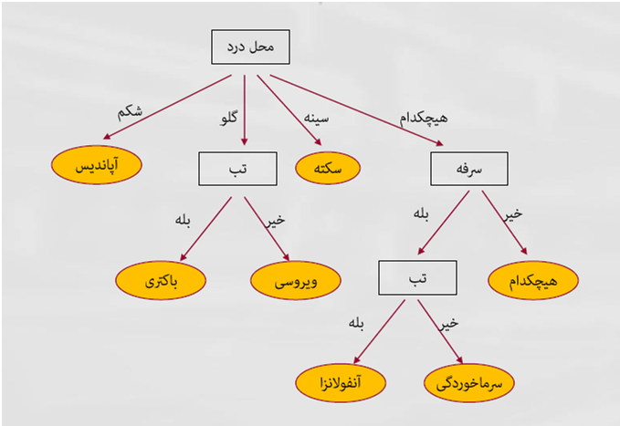

  
  ### 10- یک نمونه ی واقعی از استفاده ی درخت تصمیم در دنیای واقعی را به صورت کوتاه توضیح دهید.
   
  در زیر ساختار یک درخت تصمیم جهت تعیین نوع بیماری (دسته) بر اساس نشانگان مختلف، نمایش داده‌شده است:
  در این مثال مثلا وقتی که به دکتر مراجعه شود، دکتر بر اساس یک سری شواهد کلی تصمیماتی را برای تجویز نسخه یا ....میگیرد که این یک نمونه از فرایند تصمیم گیری دکتر میباشد که بعد از ان شاید لازم باشد به متخصص مراجعه شود. در این درخت در واقع مهمترین ویژگی فهمیدن نوع مشکل و درد بیمار است که با فهمیدن محل درد و سپس بررسی سایر ویژگی های بعدی که به ترتیب کم اهمیت تر هست به نوع بیماری نزدیک میشود. 
    
  به طور مثال دکتر بررسی میکند که اگر محل درد در سینه است پس  دچار سکته شده است و اگر سرفه داشت و تب هم داشت پس دچار انفولانزا شده است اگر سرفه داشت ولی تب نداشت پس سرماخورده است.  
   
  

  
     
  

   
 

البته این درخت که باینری نیست اما درخت تصمیم هم باینری هم غیر باینری میتواند باشد و کلا در اکثر زمینه های داده کاوی و حتی در اکثر تصمیمات روزمره عادی در زندگی مثل خرید محصول و یا حتی غذا خوردن که مثلا ایا از قبل غذا هست یا نه اگر غذای پخته نباشد، اگر وقت کافی دارم پس فسنجون پخته شود و اگر نیست نیمرو بزنم.  

 
 

 
 

  
 

 

